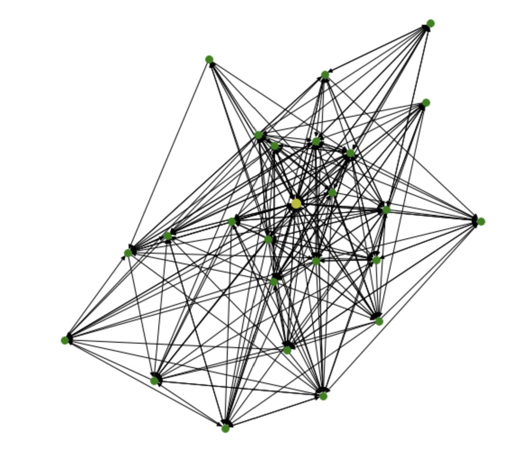

# 👋 Hi, I'm Chandrika Patibandla  
**Data Analyst | Aspiring Data Scientist**  
Turning complex data into actionable insights using **Python, SQL, Tableau, and Machine Learning.**  

🔗 [LinkedIn](https://linkedin.com/in/chandrika-patibandla) • [Tableau Public](https://public.tableau.com/app/profile/chandrika.patibandla1429) • [Resume PDF](#)  

---

## 🧠 About Me  
Data Analyst with 5+ years of cross-functional experience in **analytics, research, and visualization**.  
Published **IEEE author** in cognitive workload detection using hybrid imaging (NIR/LWIR).  
I enjoy building predictive models, analytical dashboards, and visual stories that turn raw data into business decisions.  

---

## ⚙️ Core Skills  

| Category | Tools & Technologies |
|-----------|----------------------|
| **Programming & Analysis** | Python (Pandas, NumPy, scikit-learn), SQL, MATLAB, Excel |
| **Data Visualization** | Tableau, Power BI, Matplotlib, Seaborn |
| **Machine Learning** | Random Forest, PCA, Regression, Clustering, A/B Testing |
| **Data Engineering** | ETL Pipelines, Data Cleaning, Feature Engineering |
| **Cloud & Tools** | GitHub, Azure (in progress), fNIRS Photon Cap |
| **Web & Design** | WordPress, Wix, FIGMA |

---

## 💼 Featured Projects — Turning Data into Decisions  

<table align="center">
<tr>
  <td align="center">
    <a href="https://github.com/Chandrika2914/Healthcare-Predictive-Analytics">
       
      <b>Healthcare Predictive Analytics</b>
    </a> 
    <i>Random Forest | PCA | 86.2% Accuracy</i> 
    Predicting hemoglobin levels and visualizing key predictors in healthcare data.
  </td>
  <td align="center">
    <a href="https://github.com/Chandrika2914/TSUNAMI-Detection">
       
      <b>Tsunami Detection</b>
    </a> 
    <i>Signal Classification | PCA | Random Forest</i> 
    Machine learning model for early seismic signal classification (91% accuracy).
  </td>
</tr>
<tr>
  <td align="center">
    <a href="https://github.com/Chandrika2914/Twitter-Sentiment-Analysis">
       
      <b>Twitter Sentiment Analysis</b>
    </a> 
    <i>NLP | TextBlob | Data Visualization</i> 
    Analyzing 20K+ tweets to uncover real-time sentiment trends.
  </td>
  <td align="center">
    <a href="https://github.com/Chandrika2914/World-Happiness-Report">
       
      <b>World Happiness Report 2021</b>
    </a> 
    <i>Exploratory Analysis | Tableau | Python</i> 
    Visual storytelling of global happiness drivers and socioeconomic impact.
  </td>
</tr>
</table>

---

## 📊 Tableau Dashboards — Data Storytelling in Action  

| Dashboard | Description | Link |
|------------|-------------|------|
| **World Happiness 2021** | Interactive dashboard showing how GDP, Life Expectancy & Social Support affect happiness. | [View on Tableau →](https://public.tableau.com/app/profile/chandrika.patibandla1429) |
| **COVID-19 Analysis** | Geospatial & temporal trends visualization built in Tableau. | [View Dashboard →](#) |
| **EY Data Reporting Study** | Redesigned analytics reports using Tableau & Python for better accuracy. | [View Story →](#) |

> 💡 Each dashboard focuses on **clarity, storytelling, and actionable insights**, blending design with data interpretation.

---

## 🧬 Research & Publications  

**🧠 Cognitive Workload Detection (IEEE, 2023)**  
Co-authored publication on **ML-based cognitive workload classification** using hybrid NIR/LWIR imaging — achieved **73.7% classification accuracy**.  
📄 [Read Publication](https://doi.org/10.1109/TechDefense59795.2023.10380919)

---

## 💡 Business Takeaways  

- Predictive modeling can improve data-driven healthcare outcomes.  
- NLP-based sentiment tracking helps understand social perception trends.  
- Data visualization enables storytelling for leadership decisions.  

---

## 🏆 Achievements & Certifications  

- **IEEE Conference Publication (2023)** – Cognitive Workload Detection  
- **Coursera Certification** – Exploratory Data Analysis with MATLAB (MathWorks)  
- **Featured Tableau Dashboard** – World Happiness Report  

---

## 👩‍💻 Professional Experience  

**Next2U Srl (Italy)** – *Data Analyst (Jan 2023 – Aug 2024)*  
Analyzed multispectral imaging data for pilot training studies; co-authored IEEE paper.  
Automated ML preprocessing pipeline in Python and developed interactive analytical reports.

**Mouktik Consulting (India)** – *Assistant Team Lead (2018 – 2019)*  
Led data-driven escalation tracking system reducing SLA delays by 40%.  
Mentored support analysts and improved reporting accuracy.

---

## 📫 Connect with Me  
💌 **Email:** chandrika1429@gmail.com  
🔗 **LinkedIn:** [linkedin.com/in/chandrika-patibandla](https://linkedin.com/in/chandrika-patibandla)  
📊 **Tableau Public:** [Chandrika’s Visualizations](https://public.tableau.com/app/profile/chandrika.patibandla1429)
